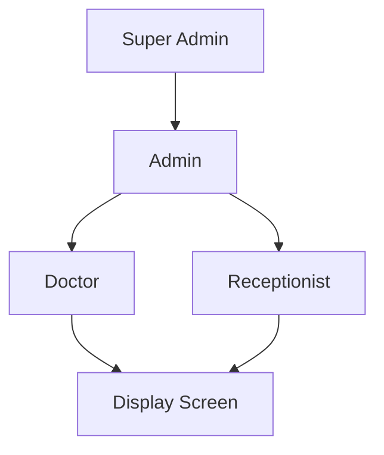

# 🏥 نظام إدارة التذاكر والعيادات للمستشفيات
## Hospital Queue Management System (Tazaker)

<div align="center">


**نظام متكامل لإدارة قوائم الانتظار والتذاكر في المستشفيات مع إشعارات SMS في الوقت الفعلي**

[Features](#-المميزات-الرئيسية) •
[Planning](#-التخطيط) •
[Architecture](#-البنية-التقنية) •
[Installation](#-التثبيت) •
[Documentation](#-التوثيق)

</div>

---

## ✨ المميزات الرئيسية

### 📺 شاشات العرض في الوقت الفعلي
- ✅ عرض حالة جميع العيادات (مشغول/متاح/مغلق)
- ✅ رقم التذكرة الحالية والتالية
- ✅ عدد المنتظرين والوقت المتوقع
- ✅ تحديث تلقائي كل ثانية عبر WebSocket
- ✅ دعم متعدد اللغات (عربي/إنجليزي)

### 📱 إشعارات SMS تلقائية
- ✅ إرسال رسالة عند إصدار التذكرة
- ✅ تنبيه قبل الدور بـ 2-3 مرضى
- ✅ إشعار عند حلول الدور
- ✅ دعم Twilio و Mobily APIs

### 👥 واجهات متعددة للمستخدمين
- **موظف الاستقبال**: إصدار التذاكر بسرعة
- **الطبيب**: استدعاء المرضى وإدارة القائمة
- **المدير**: التقارير والإحصائيات الشاملة
- **شاشة العرض**: المتابعة الفورية لجميع العيادات

### 📊 تقارير وإحصائيات متقدمة
- ✅ تقارير يومية وأسبوعية وشهرية
- ✅ إحصائيات أداء العيادات والأطباء
- ✅ متوسط أوقات الانتظار والخدمة
- ✅ تصدير بصيغ متعددة (PDF, Excel, CSV)

---

## 📋 التخطيط

### 📖 الوثائق المتاحة

- **[hospital_system_plan.md](hospital_system_plan.md)** - الخطة الشاملة للنظام
  - تصميم قاعدة البيانات (9 جداول)
  - أصحاب المصلحة وطبقات المستخدمين
  - سير العمل التفصيلي (Workflows)
  - واجهات API كاملة (RESTful + WebSocket)
  - البنية الخلفية والأمامية
  - تصميم UI/UX

### 🗂️ أصحاب المصلحة (Stakeholders)

| المستخدم | الاحتياجات الرئيسية | الفوائد |
|---------|---------------------|---------|
| 👨‍⚕️ **المرضى** | تذاكر إلكترونية + إشعارات SMS | تقليل وقت الانتظار الفعلي |
| 👨‍⚕️ **الأطباء** | استدعاء المرضى + إحصائيات | تنظيم أفضل للعمل |
| 👔 **موظفو الاستقبال** | إصدار التذاكر بسرعة | تسريع عملية الاستقبال |
| 📊 **الإدارة** | تقارير شاملة + تحليلات | قرارات مبنية على البيانات |
| 💻 **تقنية المعلومات** | نظام سهل الصيانة | سهولة الإدارة والاستقرار |

### 🔐 طبقات المستخدمين (User Layers)



| الطبقة | الصلاحيات | الواجهة |
|-------|----------|---------|
| **Super Admin** | ✅ كل الصلاحيات | لوحة تحكم شاملة |
| **Admin** | ✅ إدارة المستخدمين والعيادات | لوحة إدارة |
| **Doctor** | ✅ استدعاء المرضى فقط | واجهة الطبيب |
| **Receptionist** | ✅ إصدار التذاكر فقط | واجهة الاستقبال |
| **Display Screen** | ✅ عرض فقط (Read-Only) | شاشة عرض |

---

## 🏗️ البنية التقنية

### Backend Stack
```
Node.js v18+ + Express.js
├── Database: PostgreSQL 15+
├── Cache: Redis
├── Real-time: Socket.io (WebSocket)
├── Authentication: JWT
└── SMS: Twilio / Mobily API
```

### Frontend Stack
```
React 18+ + Tailwind CSS
├── State Management: Redux Toolkit
├── Real-time: Socket.io Client
├── HTTP Client: Axios
├── UI Components: Custom + Headless UI
└── i18n: i18next (Arabic/English)
```

### 🗄️ قاعدة البيانات

**9 جداول رئيسية:**
1. `users` - المستخدمون (Super Admin, Admin, Doctor, Receptionist)
2. `clinics` - العيادات
3. `doctors` - الأطباء (مرتبطة بـ users و clinics)
4. `patients` - المرضى
5. `tickets` - التذاكر (6 حالات: waiting, called, serving, completed, cancelled, no_show)
6. `sms_notifications` - إشعارات SMS (issued, reminder, called)
7. `audit_logs` - سجلات التدقيق
8. `system_settings` - إعدادات النظام
9. `daily_statistics` - الإحصائيات اليومية

**للتفاصيل الكاملة**: راجع [hospital_system_plan.md](hospital_system_plan.md#-تصميم-قاعدة-البيانات-database-design)

---

## 🔄 سير العمل (Workflows)

### 1️⃣ تدفق إصدار التذكرة
```
مريض → استقبال → بحث/تسجيل → اختيار عيادة →
إصدار تذكرة → طباعة + SMS → تحديث شاشة العرض
```

### 2️⃣ تدفق استدعاء المريض
```
طبيب جاهز → استدعاء التالي → تحديث حالة →
إرسال SMS → عرض على الشاشة → بدء الفحص → إكمال
```

### 3️⃣ تدفق إشعارات SMS
- **إصدار**: "تم إصدار تذكرة A-123، موقعك: 5، الوقت المتوقع: 25 دقيقة"
- **تنبيه**: "سيحين دورك قريباً! متبقي 2-3 مرضى"
- **استدعاء**: "حان دورك الآن! الرجاء التوجه للعيادة"

**للتفاصيل الكاملة**: راجع [hospital_system_plan.md](hospital_system_plan.md#-سير-العمل-workflow)

---

## 🔌 واجهات API

### Authentication
- `POST /api/v1/auth/login` - تسجيل الدخول
- `POST /api/v1/auth/logout` - تسجيل الخروج
- `GET /api/v1/auth/me` - معلومات المستخدم

### Tickets
- `POST /api/v1/tickets` - إصدار تذكرة جديدة
- `GET /api/v1/tickets/:id` - تفاصيل التذكرة
- `GET /api/v1/tickets/clinic/:id/queue` - قائمة الانتظار
- `PUT /api/v1/tickets/:id/call` - استدعاء مريض
- `PUT /api/v1/tickets/:id/complete` - إكمال الخدمة

### Clinics
- `GET /api/v1/clinics` - قائمة العيادات
- `GET /api/v1/clinics/:id` - تفاصيل عيادة
- `POST /api/v1/clinics` - إنشاء عيادة (Admin)

### WebSocket Events
- `ticket:created` - تذكرة جديدة
- `ticket:called` - استدعاء مريض
- `clinic:status_changed` - تغيير حالة عيادة
- `queue:updated` - تحديث القائمة

**للتفاصيل الكاملة**: راجع [hospital_system_plan.md](hospital_system_plan.md#-واجهات-api)

---

## 🎨 تصميم UI/UX

### نظام الألوان
- **Primary**: Blue (#0066CC) - الأزرق الرئيسي
- **Success**: Green (#10B981) - حالة النجاح
- **Warning**: Orange (#F59E0B) - التنبيهات
- **Error**: Red (#EF4444) - الأخطاء
- **Info**: Blue (#3B82F6) - المعلومات

### الواجهات
- **موظف الاستقبال**: بحث + نموذج مريض + اختيار عيادة + طباعة
- **الطبيب**: قائمة انتظار + استدعاء التالي + إحصائيات
- **شاشة العرض**: Cards ملونة لكل عيادة مع تحديث فوري
- **المدير**: Dashboard + Charts + Reports

### إمكانية الوصول
- ✅ WCAG 2.1 Level AA compliance
- ✅ دعم RTL للعربية
- ✅ قارئ الشاشة
- ✅ التنقل بلوحة المفاتيح

**للتفاصيل الكاملة**: راجع [hospital_system_plan.md](hospital_system_plan.md#-تصميم-uiux)

---

## 📥 التثبيت

### المتطلبات الأساسية
- Node.js v18+
- PostgreSQL 15+
- Redis 6+
- npm أو yarn

### خطوات التثبيت السريعة

```bash
# 1. استنساخ المشروع
git clone https://github.com/yourusername/tazaker.git
cd tazaker

# 2. إعداد قاعدة البيانات
createdb hospital_queue
psql -d hospital_queue -f database/schema.sql
psql -d hospital_queue -f database/seed.sql

# 3. تثبيت Backend
cd backend
npm install
cp .env.example .env
# عدّل ملف .env بالإعدادات المناسبة
npm run dev

# 4. تثبيت Frontend (في terminal جديد)
cd frontend
npm install
cp .env.example .env
npm start
```

### الحساب الافتراضي
- **Username**: `admin`
- **Password**: `Admin@123`

**📖 للتفاصيل الكاملة**: سيتم إنشاء `INSTALLATION_GUIDE.md` قريباً

---

## 📁 هيكل المشروع

```
Tazaker/
├── README.md                           # هذا الملف
├── hospital_system_plan.md             # الخطة الشاملة
├── INSTALLATION_GUIDE.md               # دليل التثبيت (قريباً)
│
├── backend/                            # Backend (Node.js + Express)
│   ├── src/
│   │   ├── config/                    # إعدادات (DB, Redis, JWT, SMS)
│   │   ├── models/                    # Models (User, Clinic, Ticket...)
│   │   ├── controllers/               # Business logic
│   │   ├── routes/                    # API routes
│   │   ├── middleware/                # Auth, validation, error handling
│   │   ├── services/                  # SMS, Queue, Notification services
│   │   ├── websocket/                 # Socket.io handlers
│   │   └── workers/                   # Background jobs
│   ├── database/
│   │   ├── schema.sql                 # Database schema
│   │   └── seed.sql                   # Initial data
│   └── package.json
│
└── frontend/                           # Frontend (React + Tailwind)
    ├── src/
    │   ├── components/                # React components
    │   │   ├── common/               # Button, Input, Modal...
    │   │   ├── receptionist/         # Ticket issue interface
    │   │   ├── doctor/               # Doctor interface
    │   │   ├── display/              # Display screen
    │   │   └── admin/                # Admin dashboard
    │   ├── pages/                     # Page components
    │   ├── services/                  # API + WebSocket services
    │   ├── hooks/                     # Custom React hooks
    │   └── i18n/                      # Arabic/English translations
    └── package.json
```

---

## 📊 قائمة المهام (Task List)

### ✅ المكتمل
- [x] إنشاء خطة النظام الشاملة
- [x] تصميم قاعدة البيانات
- [x] تصميم واجهات API
- [x] تحديد سير العمل

### 🚧 قيد التنفيذ
- [ ] إنشاء ملفات SQL (schema + seed)
- [ ] بناء Backend API
- [ ] بناء Frontend
- [ ] تكامل SMS
- [ ] تنفيذ WebSocket

### 📋 قادم
- [ ] الاختبارات (Unit + Integration)
- [ ] التوثيق الكامل
- [ ] دليل التثبيت
- [ ] النشر والتدريب

**للقائمة الكاملة**: راجع [hospital_system_plan.md](hospital_system_plan.md#-خطة-التنفيذ)

---

## 🔒 الأمان والخصوصية

- ✅ تشفير كلمات المرور (bcrypt)
- ✅ JWT Authentication مع Refresh Tokens
- ✅ Role-Based Access Control (RBAC)
- ✅ Input validation وحماية من SQL Injection
- ✅ Rate limiting لمنع الهجمات
- ✅ Audit logs لجميع العمليات الحساسة
- ✅ HTTPS إلزامي في Production

---

## 📈 الأداء وإمكانية التوسع

### Optimization
- Redis caching للبيانات المتكررة
- Database indexing للاستعلامات السريعة
- WebSocket للتحديثات الفورية بدون polling
- Lazy loading للواجهات

### Scalability
- Load Balancer (Nginx)
- Multiple Backend instances
- Redis Cluster
- Database Replication

---

## 📖 التوثيق

| الوثيقة | الوصف | الحالة |
|---------|-------|--------|
| [README.md](README.md) | نظرة عامة على المشروع | ✅ جاهز |
| [hospital_system_plan.md](hospital_system_plan.md) | الخطة الشاملة للنظام | ✅ جاهز |
| INSTALLATION_GUIDE.md | دليل التثبيت المفصل | 🚧 قيد الإنشاء |
| API_DOCUMENTATION.md | توثيق API كامل | 📋 قادم |
| USER_MANUAL.md | دليل المستخدم | 📋 قادم |

---

## 🤝 المساهمة

نرحب بالمساهمات! الرجاء:
1. Fork المشروع
2. إنشاء branch للميزة (`git checkout -b feature/AmazingFeature`)
3. Commit التغييرات (`git commit -m 'Add some AmazingFeature'`)
4. Push للـ branch (`git push origin feature/AmazingFeature`)
5. فتح Pull Request

---

## 📄 الترخيص

هذا المشروع مرخص بموجب [MIT License](LICENSE).

---

## 📞 الدعم والتواصل

- **Issues**: [GitHub Issues](https://github.com/yourusername/tazaker/issues)
- **Discussions**: [GitHub Discussions](https://github.com/yourusername/tazaker/discussions)
- **Email**: support@tazaker.com

---

## 🌟 شكر خاص

شكراً لكل من ساهم في تطوير هذا النظام!

---

<div align="center">

**صُنع بـ ❤️ في السعودية**

⭐ إذا أعجبك المشروع، لا تنسَ إعطائه نجمة!

</div>