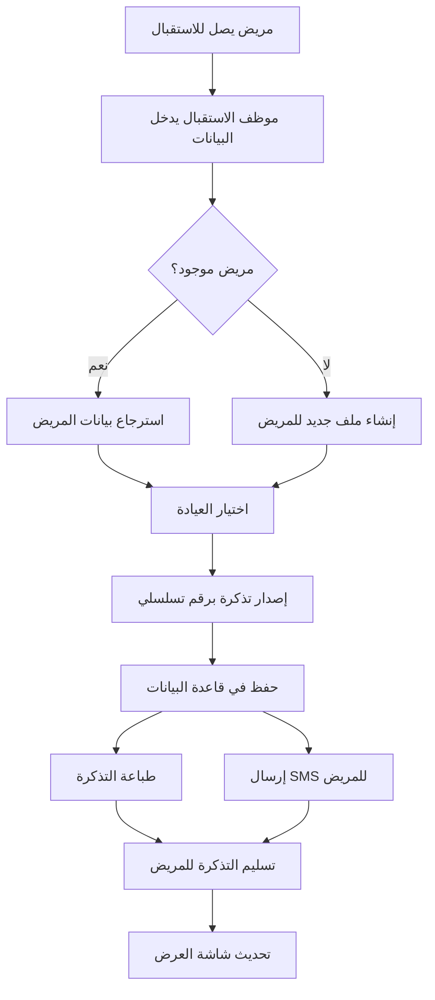
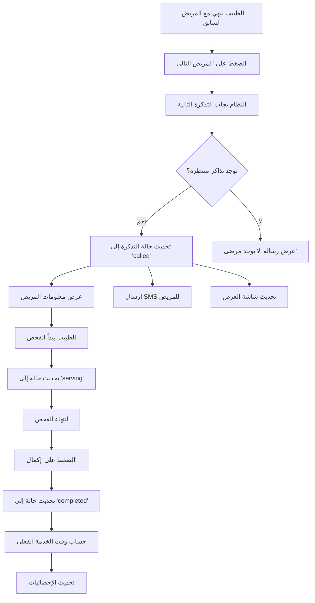
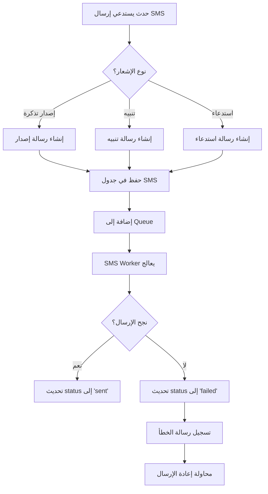
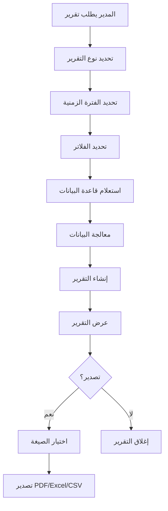

# 🏥 خطة نظام إدارة التذاكر والعيادات للمستشفيات
# Hospital Queue Management System - Comprehensive Plan

<div align="center">

**نظام متكامل لإدارة قوائم الانتظار والتذاكر في المستشفيات**

Version: 1.0.0 | Date: 2025-11-10

</div>

---

## 📋 جدول المحتويات

1. [نظرة عامة](#-نظرة-عامة)
2. [أصحاب المصلحة](#-أصحاب-المصلحة-stakeholders)
3. [طبقات المستخدمين](#-طبقات-المستخدمين-user-layers)
4. [تصميم قاعدة البيانات](#-تصميم-قاعدة-البيانات-database-design)
5. [سير العمل](#-سير-العمل-workflow)
6. [واجهات API](#-واجهات-api)
7. [البنية الخلفية](#-البنية-الخلفية-backend-architecture)
8. [البنية الأمامية](#-البنية-الأمامية-frontend-architecture)
9. [تصميم UI/UX](#-تصميم-uiux)
10. [خطة التنفيذ](#-خطة-التنفيذ)

---

## 🎯 نظرة عامة

### الهدف من النظام
نظام شامل لإدارة قوائم الانتظار في العيادات الخارجية للمستشفيات مع:
- ✅ إصدار تذاكر إلكترونية
- ✅ إشعارات SMS فورية
- ✅ شاشات عرض في الوقت الفعلي
- ✅ تقارير وإحصائيات شاملة

### التقنيات المستخدمة

#### Backend Stack
- **Runtime**: Node.js v18+
- **Framework**: Express.js
- **Database**: PostgreSQL 15+
- **Cache**: Redis
- **Real-time**: Socket.io (WebSocket)
- **Authentication**: JWT (JSON Web Tokens)
- **SMS**: Twilio / Mobily API

#### Frontend Stack
- **Framework**: React 18+
- **Styling**: Tailwind CSS
- **State Management**: Redux Toolkit / Context API
- **Real-time**: Socket.io Client
- **HTTP Client**: Axios
- **UI Components**: Custom + Headless UI
- **Internationalization**: i18next (Arabic/English)

---

## 👥 أصحاب المصلحة (Stakeholders)

### 1. المرضى (Patients)
**الاحتياجات:**
- الحصول على تذكرة بسهولة
- معرفة وقت الانتظار المتوقع
- استلام إشعارات SMS
- متابعة حالة الانتظار

**الفوائد:**
- تقليل وقت الانتظار الفعلي
- تجربة أفضل وأكثر تنظيماً
- إمكانية الانتظار خارج المستشفى

---

### 2. الأطباء (Doctors)
**الاحتياجات:**
- استدعاء المريض التالي بسهولة
- رؤية قائمة الانتظار
- إحصائيات الأداء اليومية
- إدارة وقت الاستراحة

**الفوائد:**
- تنظيم أفضل للعمل
- تقليل الضغط
- تحسين الإنتاجية

---

### 3. موظفو الاستقبال (Receptionists)
**الاحتياجات:**
- إصدار التذاكر بسرعة
- توجيه المرضى للعيادة المناسبة
- إدارة المواعيد
- طباعة التذاكر

**الفوائد:**
- تسريع عملية الاستقبال
- تقليل الأخطاء
- واجهة سهلة الاستخدام

---

### 4. الإدارة (Management)
**الاحتياجات:**
- تقارير شاملة ومفصلة
- إحصائيات الأداء
- مراقبة الجودة
- تحليل البيانات

**الفوائد:**
- اتخاذ قرارات مبنية على البيانات
- تحسين الكفاءة التشغيلية
- تتبع الأداء

---

### 5. إدارة تقنية المعلومات (IT Department)
**الاحتياجات:**
- نظام سهل الصيانة
- توثيق شامل
- إمكانية التوسع
- أمان عالي

**الفوائد:**
- سهولة الإدارة والصيانة
- استقرار النظام
- أمان البيانات

---

## 🔐 طبقات المستخدمين (User Layers)

### Layer 1: Super Admin (المدير العام)
**الصلاحيات الكاملة:**
- ✅ إدارة جميع المستخدمين
- ✅ إدارة العيادات والأقسام
- ✅ تعديل إعدادات النظام
- ✅ الوصول لجميع التقارير
- ✅ تدقيق السجلات (Audit Logs)
- ✅ النسخ الاحتياطي والاستعادة

**واجهة الاستخدام:**
- لوحة تحكم شاملة (Dashboard)
- إدارة المستخدمين
- إدارة العيادات
- التقارير والإحصائيات
- إعدادات النظام

---

### Layer 2: Admin (مدير النظام)
**الصلاحيات:**
- ✅ إدارة المستخدمين (ما عدا Super Admin)
- ✅ إدارة العيادات
- ✅ عرض التقارير
- ✅ مراقبة النظام
- ❌ تعديل إعدادات النظام الحساسة

**واجهة الاستخدام:**
- لوحة تحكم
- إدارة العيادات والأطباء
- تقارير مفصلة
- إحصائيات الأداء

---

### Layer 3: Doctor (طبيب)
**الصلاحيات:**
- ✅ استدعاء المريض التالي
- ✅ عرض قائمة الانتظار الخاصة به
- ✅ بدء/إيقاف استقبال المرضى
- ✅ وضع "استراحة"
- ✅ عرض إحصائياته الشخصية
- ❌ الوصول لبيانات أطباء آخرين

**واجهة الاستخدام:**
- شاشة استدعاء المرضى
- قائمة الانتظار
- إحصائيات شخصية
- حالة العيادة

---

### Layer 4: Receptionist (موظف استقبال)
**الصلاحيات:**
- ✅ إصدار تذاكر جديدة
- ✅ البحث عن المرضى
- ✅ طباعة التذاكر
- ✅ عرض حالة العيادات
- ❌ استدعاء المرضى
- ❌ عرض التقارير

**واجهة الاستخدام:**
- شاشة إصدار التذاكر
- بحث المرضى
- عرض العيادات المتاحة
- طباعة التذاكر

---

### Layer 5: Display Screen (شاشة عرض)
**الصلاحيات:**
- ✅ عرض المعلومات فقط (Read-Only)
- ✅ تحديث تلقائي
- ❌ أي تعديلات

**واجهة الاستخدام:**
- شاشة كبيرة ملونة
- عرض جميع العيادات
- الرقم الحالي والتالي
- عدد المنتظرين
- الوقت المتوقع

---

## 🗄️ تصميم قاعدة البيانات (Database Design)

### ERD Overview
```
┌─────────────┐       ┌──────────────┐       ┌─────────────┐
│   Users     │──────▶│   Clinics    │◀──────│  Doctors    │
└─────────────┘       └──────────────┘       └─────────────┘
      │                      │                       │
      │                      │                       │
      ▼                      ▼                       ▼
┌─────────────┐       ┌──────────────┐       ┌─────────────┐
│   Patients  │──────▶│   Tickets    │◀──────│   Queue     │
└─────────────┘       └──────────────┘       └─────────────┘
                             │
                             ▼
                      ┌──────────────┐
                      │     SMS      │
                      │ Notifications│
                      └──────────────┘
```

---

### Table 1: users (المستخدمون)
```sql
CREATE TABLE users (
    user_id SERIAL PRIMARY KEY,
    username VARCHAR(50) UNIQUE NOT NULL,
    password_hash VARCHAR(255) NOT NULL,
    full_name VARCHAR(100) NOT NULL,
    email VARCHAR(100) UNIQUE,
    phone VARCHAR(20),
    role VARCHAR(20) NOT NULL CHECK (role IN ('super_admin', 'admin', 'doctor', 'receptionist')),
    is_active BOOLEAN DEFAULT true,
    last_login TIMESTAMP,
    created_at TIMESTAMP DEFAULT CURRENT_TIMESTAMP,
    updated_at TIMESTAMP DEFAULT CURRENT_TIMESTAMP
);

CREATE INDEX idx_users_username ON users(username);
CREATE INDEX idx_users_role ON users(role);
```

**الأدوار (Roles):**
- `super_admin`: المدير العام
- `admin`: مدير النظام
- `doctor`: طبيب
- `receptionist`: موظف استقبال

---

### Table 2: clinics (العيادات)
```sql
CREATE TABLE clinics (
    clinic_id SERIAL PRIMARY KEY,
    clinic_name_ar VARCHAR(100) NOT NULL,
    clinic_name_en VARCHAR(100) NOT NULL,
    clinic_code VARCHAR(10) UNIQUE NOT NULL,
    department VARCHAR(50),
    status VARCHAR(20) DEFAULT 'active' CHECK (status IN ('active', 'inactive', 'closed')),
    average_time_per_patient INTEGER DEFAULT 15, -- بالدقائق
    working_hours_start TIME,
    working_hours_end TIME,
    created_at TIMESTAMP DEFAULT CURRENT_TIMESTAMP,
    updated_at TIMESTAMP DEFAULT CURRENT_TIMESTAMP
);

CREATE INDEX idx_clinics_status ON clinics(status);
CREATE INDEX idx_clinics_code ON clinics(clinic_code);
```

---

### Table 3: doctors (الأطباء)
```sql
CREATE TABLE doctors (
    doctor_id SERIAL PRIMARY KEY,
    user_id INTEGER REFERENCES users(user_id) ON DELETE CASCADE,
    clinic_id INTEGER REFERENCES clinics(clinic_id) ON DELETE SET NULL,
    specialization VARCHAR(100),
    license_number VARCHAR(50) UNIQUE,
    is_available BOOLEAN DEFAULT false,
    current_status VARCHAR(20) DEFAULT 'offline' CHECK (current_status IN ('online', 'busy', 'break', 'offline')),
    created_at TIMESTAMP DEFAULT CURRENT_TIMESTAMP,
    updated_at TIMESTAMP DEFAULT CURRENT_TIMESTAMP,
    UNIQUE(user_id)
);

CREATE INDEX idx_doctors_clinic ON doctors(clinic_id);
CREATE INDEX idx_doctors_status ON doctors(current_status);
```

**حالات الطبيب (Doctor Status):**
- `online`: متاح لاستقبال المرضى
- `busy`: مشغول مع مريض
- `break`: في استراحة
- `offline`: غير متصل

---

### Table 4: patients (المرضى)
```sql
CREATE TABLE patients (
    patient_id SERIAL PRIMARY KEY,
    medical_record_number VARCHAR(50) UNIQUE,
    full_name VARCHAR(100) NOT NULL,
    phone VARCHAR(20) NOT NULL,
    national_id VARCHAR(20),
    date_of_birth DATE,
    gender VARCHAR(10) CHECK (gender IN ('male', 'female')),
    email VARCHAR(100),
    created_at TIMESTAMP DEFAULT CURRENT_TIMESTAMP,
    updated_at TIMESTAMP DEFAULT CURRENT_TIMESTAMP
);

CREATE INDEX idx_patients_mrn ON patients(medical_record_number);
CREATE INDEX idx_patients_phone ON patients(phone);
CREATE INDEX idx_patients_national_id ON patients(national_id);
```

---

### Table 5: tickets (التذاكر)
```sql
CREATE TABLE tickets (
    ticket_id SERIAL PRIMARY KEY,
    ticket_number VARCHAR(20) UNIQUE NOT NULL,
    clinic_id INTEGER REFERENCES clinics(clinic_id) ON DELETE CASCADE,
    patient_id INTEGER REFERENCES patients(patient_id) ON DELETE CASCADE,
    doctor_id INTEGER REFERENCES doctors(doctor_id) ON DELETE SET NULL,
    issued_by INTEGER REFERENCES users(user_id),
    status VARCHAR(20) DEFAULT 'waiting' CHECK (status IN ('waiting', 'called', 'serving', 'completed', 'cancelled', 'no_show')),
    priority INTEGER DEFAULT 0, -- 0: عادي, 1: أولوية, 2: طارئ
    queue_position INTEGER,
    issued_at TIMESTAMP DEFAULT CURRENT_TIMESTAMP,
    called_at TIMESTAMP,
    serving_started_at TIMESTAMP,
    completed_at TIMESTAMP,
    estimated_time INTEGER, -- الوقت المتوقع بالدقائق
    actual_service_time INTEGER, -- الوقت الفعلي بالدقائق
    notes TEXT,
    created_at TIMESTAMP DEFAULT CURRENT_TIMESTAMP,
    updated_at TIMESTAMP DEFAULT CURRENT_TIMESTAMP
);

CREATE INDEX idx_tickets_number ON tickets(ticket_number);
CREATE INDEX idx_tickets_status ON tickets(status);
CREATE INDEX idx_tickets_clinic ON tickets(clinic_id);
CREATE INDEX idx_tickets_patient ON tickets(patient_id);
CREATE INDEX idx_tickets_date ON tickets(DATE(issued_at));
```

**حالات التذكرة (Ticket Status):**
- `waiting`: في قائمة الانتظار
- `called`: تم استدعاء المريض
- `serving`: جاري الخدمة
- `completed`: تمت الخدمة
- `cancelled`: ملغية
- `no_show`: لم يحضر المريض

---

### Table 6: sms_notifications (إشعارات SMS)
```sql
CREATE TABLE sms_notifications (
    notification_id SERIAL PRIMARY KEY,
    ticket_id INTEGER REFERENCES tickets(ticket_id) ON DELETE CASCADE,
    phone VARCHAR(20) NOT NULL,
    message TEXT NOT NULL,
    notification_type VARCHAR(20) CHECK (notification_type IN ('issued', 'reminder', 'called')),
    status VARCHAR(20) DEFAULT 'pending' CHECK (status IN ('pending', 'sent', 'failed')),
    sent_at TIMESTAMP,
    error_message TEXT,
    created_at TIMESTAMP DEFAULT CURRENT_TIMESTAMP
);

CREATE INDEX idx_sms_ticket ON sms_notifications(ticket_id);
CREATE INDEX idx_sms_status ON sms_notifications(status);
```

**أنواع الإشعارات:**
- `issued`: عند إصدار التذكرة
- `reminder`: تنبيه قبل الدور (2-3 مرضى)
- `called`: إشعار حلول الدور

---

### Table 7: audit_logs (سجلات التدقيق)
```sql
CREATE TABLE audit_logs (
    log_id SERIAL PRIMARY KEY,
    user_id INTEGER REFERENCES users(user_id),
    action VARCHAR(50) NOT NULL,
    entity_type VARCHAR(50),
    entity_id INTEGER,
    old_values JSONB,
    new_values JSONB,
    ip_address INET,
    user_agent TEXT,
    created_at TIMESTAMP DEFAULT CURRENT_TIMESTAMP
);

CREATE INDEX idx_audit_user ON audit_logs(user_id);
CREATE INDEX idx_audit_action ON audit_logs(action);
CREATE INDEX idx_audit_date ON audit_logs(DATE(created_at));
```

---

### Table 8: system_settings (إعدادات النظام)
```sql
CREATE TABLE system_settings (
    setting_id SERIAL PRIMARY KEY,
    setting_key VARCHAR(50) UNIQUE NOT NULL,
    setting_value TEXT,
    setting_type VARCHAR(20) CHECK (setting_type IN ('string', 'number', 'boolean', 'json')),
    description TEXT,
    is_public BOOLEAN DEFAULT false,
    created_at TIMESTAMP DEFAULT CURRENT_TIMESTAMP,
    updated_at TIMESTAMP DEFAULT CURRENT_TIMESTAMP
);
```

**إعدادات مهمة:**
- `sms_provider`: Twilio أو Mobily
- `reminder_threshold`: عدد المرضى قبل إرسال التنبيه
- `auto_refresh_interval`: فترة التحديث التلقائي
- `working_hours_start`: بداية دوام المستشفى
- `working_hours_end`: نهاية دوام المستشفى

---

### Table 9: daily_statistics (الإحصائيات اليومية)
```sql
CREATE TABLE daily_statistics (
    stat_id SERIAL PRIMARY KEY,
    stat_date DATE NOT NULL,
    clinic_id INTEGER REFERENCES clinics(clinic_id),
    doctor_id INTEGER REFERENCES doctors(doctor_id),
    total_tickets INTEGER DEFAULT 0,
    completed_tickets INTEGER DEFAULT 0,
    cancelled_tickets INTEGER DEFAULT 0,
    no_show_tickets INTEGER DEFAULT 0,
    average_service_time INTEGER, -- بالدقائق
    average_waiting_time INTEGER, -- بالدقائق
    total_patients INTEGER DEFAULT 0,
    created_at TIMESTAMP DEFAULT CURRENT_TIMESTAMP,
    UNIQUE(stat_date, clinic_id, doctor_id)
);

CREATE INDEX idx_stats_date ON daily_statistics(stat_date);
CREATE INDEX idx_stats_clinic ON daily_statistics(clinic_id);
```

---

## 🔄 سير العمل (Workflow)

### 1. تدفق إصدار التذكرة (Ticket Issuance Flow)



**الخطوات التفصيلية:**

1. **استقبال المريض**
   - موظف الاستقبال يسجل دخول النظام
   - يفتح واجهة إصدار التذاكر

2. **إدخال البيانات**
   - إدخال رقم الهوية/السجل الطبي
   - البحث في قاعدة البيانات

3. **التحقق من المريض**
   - إذا موجود: استرجاع بيانات المريض
   - إذا جديد: ملء نموذج التسجيل (الاسم، الهاتف، تاريخ الميلاد)

4. **اختيار العيادة**
   - عرض قائمة العيادات المتاحة
   - عرض عدد المنتظرين والوقت المتوقع لكل عيادة
   - اختيار العيادة المناسبة

5. **إصدار التذكرة**
   - توليد رقم تذكرة فريد (مثال: A-123)
   - تحديد الأولوية (عادي/أولوية/طارئ)
   - حساب الموقع في قائمة الانتظار

6. **حفظ البيانات**
   - حفظ التذكرة في قاعدة البيانات
   - تحديث عدد المنتظرين
   - حساب الوقت المتوقع

7. **طباعة التذكرة**
   - طباعة تذكرة تحتوي على:
     * رقم التذكرة
     * اسم المريض
     * اسم العيادة
     * الموقع في القائمة
     * الوقت المتوقع
     * QR Code (اختياري)

8. **إرسال SMS**
   - إرسال رسالة نصية تحتوي على:
     * رقم التذكرة
     * اسم العيادة
     * الموقع في القائمة
     * الوقت المتوقع

9. **تحديث الشاشات**
   - إرسال تحديث عبر WebSocket
   - تحديث شاشة العرض
   - تحديث واجهة الطبيب

---

### 2. تدفق استدعاء المريض (Patient Calling Flow)



**الخطوات التفصيلية:**

1. **بداية الجلسة**
   - الطبيب يسجل دخول النظام
   - تحديث حالة الطبيب إلى `online`
   - عرض عدد المرضى المنتظرين

2. **استدعاء المريض التالي**
   - الضغط على زر "المريض التالي"
   - النظام يجلب أول تذكرة في قائمة الانتظار
   - مراعاة الأولوية (طوارئ > أولوية > عادي)

3. **تحديث حالة التذكرة**
   - تغيير status من `waiting` إلى `called`
   - تسجيل وقت الاستدعاء `called_at`
   - تحديث حالة الطبيب إلى `busy`

4. **الإشعارات**
   - إرسال SMS للمريض: "الرجاء التوجه للعيادة..."
   - تحديث شاشة العرض (عرض رقم التذكرة المستدعاة)
   - تحديث لوحة الطبيب

5. **بداية الخدمة**
   - عند دخول المريض، الضغط على "بدأ الفحص"
   - تحديث status إلى `serving`
   - تسجيل وقت البداية `serving_started_at`

6. **انتهاء الخدمة**
   - الضغط على "إكمال"
   - تحديث status إلى `completed`
   - تسجيل وقت الانتهاء `completed_at`
   - حساب الوقت الفعلي: `completed_at - serving_started_at`

7. **التعامل مع عدم الحضور**
   - إذا لم يحضر المريض خلال 5 دقائق
   - الضغط على "لم يحضر"
   - تحديث status إلى `no_show`
   - نقل التذكرة لنهاية القائمة أو إلغائها

8. **وضع الاستراحة**
   - الطبيب يمكنه الضغط على "استراحة"
   - تحديث status إلى `break`
   - إيقاف استدعاء مرضى جدد
   - عرض "في استراحة" على شاشة العرض

---

### 3. تدفق إشعارات SMS (SMS Notification Flow)



**أنواع الإشعارات:**

1. **إشعار إصدار التذكرة** (`issued`)
```
مرحباً [اسم المريض]
تم إصدار تذكرة رقم: [A-123]
العيادة: [اسم العيادة]
موقعك في القائمة: [5]
الوقت المتوقع: [25 دقيقة]
```

2. **إشعار تنبيه** (`reminder`)
```
عزيزي [اسم المريض]
سيحين دورك قريباً!
تذكرة: [A-123]
العيادة: [اسم العيادة]
متبقي: [2-3 مرضى]
```

3. **إشعار استدعاء** (`called`)
```
عزيزي [اسم المريض]
حان دورك الآن!
تذكرة: [A-123]
الرجاء التوجه إلى: [اسم العيادة]
```

---

### 4. تدفق التقارير (Reporting Flow)



---

## 🔌 واجهات API

### أساس التصميم
- **Protocol**: RESTful API
- **Format**: JSON
- **Authentication**: JWT Bearer Token
- **Base URL**: `/api/v1`

---

### 1. Authentication APIs

#### POST /api/v1/auth/login
تسجيل الدخول

**Request:**
```json
{
  "username": "doctor1",
  "password": "SecurePass@123"
}
```

**Response (200):**
```json
{
  "success": true,
  "data": {
    "user": {
      "user_id": 5,
      "username": "doctor1",
      "full_name": "د. أحمد محمد",
      "role": "doctor",
      "email": "doctor1@hospital.com"
    },
    "token": "eyJhbGciOiJIUzI1NiIsInR5cCI6IkpXVCJ9...",
    "expiresIn": 86400
  },
  "message": "تم تسجيل الدخول بنجاح"
}
```

---

#### POST /api/v1/auth/logout
تسجيل الخروج

**Headers:**
```
Authorization: Bearer {token}
```

**Response (200):**
```json
{
  "success": true,
  "message": "تم تسجيل الخروج بنجاح"
}
```

---

#### GET /api/v1/auth/me
الحصول على معلومات المستخدم الحالي

**Response (200):**
```json
{
  "success": true,
  "data": {
    "user_id": 5,
    "username": "doctor1",
    "full_name": "د. أحمد محمد",
    "role": "doctor",
    "email": "doctor1@hospital.com",
    "phone": "+966501234567"
  }
}
```

---

### 2. Clinics APIs

#### GET /api/v1/clinics
الحصول على قائمة العيادات

**Query Parameters:**
- `status`: active, inactive, closed
- `page`: رقم الصفحة (default: 1)
- `limit`: عدد النتائج (default: 10)

**Response (200):**
```json
{
  "success": true,
  "data": {
    "clinics": [
      {
        "clinic_id": 1,
        "clinic_name_ar": "عيادة الباطنية",
        "clinic_name_en": "Internal Medicine",
        "clinic_code": "INT-01",
        "status": "active",
        "current_ticket": "A-045",
        "waiting_count": 8,
        "average_time": 15
      }
    ],
    "pagination": {
      "total": 25,
      "page": 1,
      "limit": 10,
      "totalPages": 3
    }
  }
}
```

---

#### GET /api/v1/clinics/:id
الحصول على تفاصيل عيادة محددة

**Response (200):**
```json
{
  "success": true,
  "data": {
    "clinic_id": 1,
    "clinic_name_ar": "عيادة الباطنية",
    "clinic_name_en": "Internal Medicine",
    "clinic_code": "INT-01",
    "department": "Internal Medicine",
    "status": "active",
    "average_time_per_patient": 15,
    "working_hours_start": "08:00:00",
    "working_hours_end": "14:00:00",
    "current_doctor": {
      "doctor_id": 5,
      "full_name": "د. أحمد محمد",
      "current_status": "online"
    },
    "queue_stats": {
      "waiting": 8,
      "current_ticket": "A-045",
      "next_ticket": "A-046",
      "estimated_time": 120
    }
  }
}
```

---

#### POST /api/v1/clinics
إنشاء عيادة جديدة (Admin only)

**Request:**
```json
{
  "clinic_name_ar": "عيادة العظام",
  "clinic_name_en": "Orthopedics",
  "clinic_code": "ORTH-01",
  "department": "Orthopedics",
  "average_time_per_patient": 20,
  "working_hours_start": "08:00",
  "working_hours_end": "14:00"
}
```

---

### 3. Tickets APIs

#### POST /api/v1/tickets
إصدار تذكرة جديدة (Receptionist)

**Request:**
```json
{
  "patient_id": 123,
  "clinic_id": 1,
  "priority": 0,
  "notes": "مريض جديد"
}
```

**Response (201):**
```json
{
  "success": true,
  "data": {
    "ticket_id": 456,
    "ticket_number": "A-046",
    "patient_name": "محمد علي",
    "clinic_name": "عيادة الباطنية",
    "queue_position": 9,
    "estimated_time": 135,
    "issued_at": "2025-11-10T10:30:00Z"
  },
  "message": "تم إصدار التذكرة بنجاح"
}
```

---

#### GET /api/v1/tickets/:id
الحصول على تفاصيل تذكرة

**Response (200):**
```json
{
  "success": true,
  "data": {
    "ticket_id": 456,
    "ticket_number": "A-046",
    "status": "waiting",
    "priority": 0,
    "patient": {
      "patient_id": 123,
      "full_name": "محمد علي",
      "phone": "+966501234567"
    },
    "clinic": {
      "clinic_id": 1,
      "clinic_name_ar": "عيادة الباطنية"
    },
    "queue_position": 9,
    "estimated_time": 135,
    "issued_at": "2025-11-10T10:30:00Z"
  }
}
```

---

#### GET /api/v1/tickets/clinic/:clinicId/queue
الحصول على قائمة انتظار عيادة

**Response (200):**
```json
{
  "success": true,
  "data": {
    "clinic_id": 1,
    "current_ticket": {
      "ticket_number": "A-045",
      "patient_name": "أحمد سعيد",
      "status": "serving"
    },
    "waiting_tickets": [
      {
        "ticket_number": "A-046",
        "patient_name": "محمد علي",
        "priority": 0,
        "estimated_time": 15
      },
      {
        "ticket_number": "A-047",
        "patient_name": "فاطمة أحمد",
        "priority": 1,
        "estimated_time": 30
      }
    ],
    "total_waiting": 8
  }
}
```

---

#### PUT /api/v1/tickets/:id/call
استدعاء مريض (Doctor only)

**Response (200):**
```json
{
  "success": true,
  "data": {
    "ticket_id": 456,
    "ticket_number": "A-046",
    "status": "called",
    "patient_name": "محمد علي",
    "called_at": "2025-11-10T11:00:00Z"
  },
  "message": "تم استدعاء المريض بنجاح"
}
```

---

#### PUT /api/v1/tickets/:id/complete
إكمال خدمة مريض (Doctor only)

**Request:**
```json
{
  "notes": "تم الفحص - وصف علاج"
}
```

**Response (200):**
```json
{
  "success": true,
  "data": {
    "ticket_id": 456,
    "status": "completed",
    "actual_service_time": 18,
    "completed_at": "2025-11-10T11:18:00Z"
  },
  "message": "تم إكمال الخدمة"
}
```

---

### 4. Patients APIs

#### POST /api/v1/patients
إضافة مريض جديد

**Request:**
```json
{
  "medical_record_number": "MRN-12345",
  "full_name": "محمد علي أحمد",
  "phone": "+966501234567",
  "national_id": "1234567890",
  "date_of_birth": "1985-05-15",
  "gender": "male",
  "email": "mohamed@example.com"
}
```

---

#### GET /api/v1/patients/search
البحث عن مريض

**Query Parameters:**
- `mrn`: رقم السجل الطبي
- `phone`: رقم الهاتف
- `national_id`: رقم الهوية

**Response (200):**
```json
{
  "success": true,
  "data": {
    "patients": [
      {
        "patient_id": 123,
        "medical_record_number": "MRN-12345",
        "full_name": "محمد علي أحمد",
        "phone": "+966501234567",
        "gender": "male"
      }
    ]
  }
}
```

---

### 5. Doctors APIs

#### GET /api/v1/doctors
قائمة الأطباء

**Response (200):**
```json
{
  "success": true,
  "data": {
    "doctors": [
      {
        "doctor_id": 5,
        "full_name": "د. أحمد محمد",
        "specialization": "Internal Medicine",
        "clinic_name": "عيادة الباطنية",
        "current_status": "online",
        "patients_today": 12
      }
    ]
  }
}
```

---

#### PUT /api/v1/doctors/status
تحديث حالة الطبيب

**Request:**
```json
{
  "status": "break"
}
```

---

### 6. Reports APIs

#### GET /api/v1/reports/daily
تقرير يومي

**Query Parameters:**
- `date`: 2025-11-10
- `clinic_id`: (optional)

**Response (200):**
```json
{
  "success": true,
  "data": {
    "date": "2025-11-10",
    "summary": {
      "total_tickets": 150,
      "completed": 120,
      "cancelled": 5,
      "no_show": 10,
      "average_service_time": 16,
      "average_waiting_time": 25
    },
    "by_clinic": [
      {
        "clinic_name": "عيادة الباطنية",
        "total_tickets": 50,
        "completed": 45,
        "average_time": 15
      }
    ]
  }
}
```

---

#### GET /api/v1/reports/doctor/:doctorId
تقرير أداء طبيب

**Query Parameters:**
- `start_date`: 2025-11-01
- `end_date`: 2025-11-10

---

### 7. Display Screen API

#### GET /api/v1/display/status
حالة جميع العيادات لشاشة العرض

**Response (200):**
```json
{
  "success": true,
  "data": {
    "clinics": [
      {
        "clinic_id": 1,
        "clinic_name_ar": "عيادة الباطنية",
        "clinic_name_en": "Internal Medicine",
        "status": "busy",
        "current_ticket": "A-045",
        "next_ticket": "A-046",
        "waiting_count": 8,
        "doctor_name": "د. أحمد محمد"
      },
      {
        "clinic_id": 2,
        "clinic_name_ar": "عيادة العظام",
        "clinic_name_en": "Orthopedics",
        "status": "available",
        "current_ticket": "B-022",
        "next_ticket": "B-023",
        "waiting_count": 3,
        "doctor_name": "د. سارة علي"
      }
    ],
    "last_updated": "2025-11-10T11:30:00Z"
  }
}
```

---

### WebSocket Events

#### من Server إلى Client

**1. ticket:created**
```json
{
  "event": "ticket:created",
  "data": {
    "ticket_number": "A-046",
    "clinic_id": 1,
    "queue_position": 9
  }
}
```

**2. ticket:called**
```json
{
  "event": "ticket:called",
  "data": {
    "ticket_number": "A-046",
    "clinic_id": 1,
    "clinic_name": "عيادة الباطنية"
  }
}
```

**3. clinic:status_changed**
```json
{
  "event": "clinic:status_changed",
  "data": {
    "clinic_id": 1,
    "status": "busy",
    "current_ticket": "A-046"
  }
}
```

**4. queue:updated**
```json
{
  "event": "queue:updated",
  "data": {
    "clinic_id": 1,
    "waiting_count": 7,
    "estimated_time": 105
  }
}
```

---

## 🏗️ البنية الخلفية (Backend Architecture)

### هيكل المشروع

```
backend/
├── src/
│   ├── config/
│   │   ├── database.js        # إعدادات PostgreSQL
│   │   ├── redis.js           # إعدادات Redis
│   │   ├── jwt.js             # إعدادات JWT
│   │   └── sms.js             # إعدادات SMS (Twilio/Mobily)
│   │
│   ├── models/
│   │   ├── User.js
│   │   ├── Clinic.js
│   │   ├── Doctor.js
│   │   ├── Patient.js
│   │   ├── Ticket.js
│   │   └── SmsNotification.js
│   │
│   ├── controllers/
│   │   ├── authController.js
│   │   ├── clinicController.js
│   │   ├── ticketController.js
│   │   ├── patientController.js
│   │   ├── doctorController.js
│   │   └── reportController.js
│   │
│   ├── routes/
│   │   ├── auth.routes.js
│   │   ├── clinics.routes.js
│   │   ├── tickets.routes.js
│   │   ├── patients.routes.js
│   │   ├── doctors.routes.js
│   │   └── reports.routes.js
│   │
│   ├── middleware/
│   │   ├── auth.middleware.js        # JWT verification
│   │   ├── role.middleware.js        # Role-based access
│   │   ├── validation.middleware.js  # Input validation
│   │   └── errorHandler.middleware.js
│   │
│   ├── services/
│   │   ├── smsService.js      # إرسال SMS
│   │   ├── queueService.js    # إدارة قائمة الانتظار
│   │   ├── notificationService.js
│   │   └── reportService.js
│   │
│   ├── websocket/
│   │   ├── socketHandler.js   # WebSocket events
│   │   └── socketMiddleware.js
│   │
│   ├── workers/
│   │   ├── smsWorker.js       # معالجة SMS Queue
│   │   └── statisticsWorker.js
│   │
│   ├── utils/
│   │   ├── logger.js
│   │   ├── response.js
│   │   └── validators.js
│   │
│   └── app.js                 # Entry point
│
├── database/
│   ├── schema.sql             # Database schema
│   ├── seed.sql               # Initial data
│   └── migrations/
│
├── tests/
│   ├── unit/
│   └── integration/
│
├── .env.example
├── package.json
└── README.md
```

---

### التقنيات والمكتبات

```json
{
  "dependencies": {
    "express": "^4.18.2",
    "pg": "^8.11.0",
    "redis": "^4.6.7",
    "socket.io": "^4.6.1",
    "jsonwebtoken": "^9.0.2",
    "bcryptjs": "^2.4.3",
    "joi": "^17.9.2",
    "twilio": "^4.11.0",
    "axios": "^1.4.0",
    "dotenv": "^16.1.4",
    "winston": "^3.9.0",
    "helmet": "^7.0.0",
    "cors": "^2.8.5",
    "express-rate-limit": "^6.7.0"
  },
  "devDependencies": {
    "nodemon": "^2.0.22",
    "jest": "^29.5.0",
    "supertest": "^6.3.3"
  }
}
```

---

### أمن النظام (Security)

1. **Authentication**
   - JWT مع expiration
   - Refresh tokens
   - Password hashing (bcrypt)

2. **Authorization**
   - Role-based access control (RBAC)
   - Middleware للتحقق من الصلاحيات

3. **Protection**
   - Helmet.js (Security headers)
   - CORS configuration
   - Rate limiting
   - Input validation (Joi)
   - SQL injection prevention (Parameterized queries)
   - XSS protection

4. **Logging**
   - Winston logger
   - Audit logs لجميع العمليات الحساسة

---

## 💻 البنية الأمامية (Frontend Architecture)

### هيكل المشروع

```
frontend/
├── public/
│   ├── index.html
│   └── assets/
│       ├── images/
│       └── fonts/
│
├── src/
│   ├── components/
│   │   ├── common/
│   │   │   ├── Button.jsx
│   │   │   ├── Input.jsx
│   │   │   ├── Modal.jsx
│   │   │   ├── Spinner.jsx
│   │   │   └── Card.jsx
│   │   │
│   │   ├── layout/
│   │   │   ├── Header.jsx
│   │   │   ├── Sidebar.jsx
│   │   │   ├── Footer.jsx
│   │   │   └── Layout.jsx
│   │   │
│   │   ├── auth/
│   │   │   ├── LoginForm.jsx
│   │   │   └── ProtectedRoute.jsx
│   │   │
│   │   ├── receptionist/
│   │   │   ├── TicketIssue.jsx
│   │   │   ├── PatientSearch.jsx
│   │   │   └── ClinicSelector.jsx
│   │   │
│   │   ├── doctor/
│   │   │   ├── QueueList.jsx
│   │   │   ├── CallNextPatient.jsx
│   │   │   ├── CurrentPatient.jsx
│   │   │   └── DoctorStats.jsx
│   │   │
│   │   ├── display/
│   │   │   ├── DisplayScreen.jsx
│   │   │   ├── ClinicCard.jsx
│   │   │   └── TicketDisplay.jsx
│   │   │
│   │   └── admin/
│   │       ├── Dashboard.jsx
│   │       ├── ReportViewer.jsx
│   │       ├── UserManagement.jsx
│   │       └── ClinicManagement.jsx
│   │
│   ├── pages/
│   │   ├── Login.jsx
│   │   ├── ReceptionistDashboard.jsx
│   │   ├── DoctorDashboard.jsx
│   │   ├── DisplayScreen.jsx
│   │   └── AdminDashboard.jsx
│   │
│   ├── services/
│   │   ├── api.js              # Axios configuration
│   │   ├── authService.js
│   │   ├── ticketService.js
│   │   ├── clinicService.js
│   │   └── socketService.js    # WebSocket connection
│   │
│   ├── hooks/
│   │   ├── useAuth.js
│   │   ├── useSocket.js
│   │   ├── useQueue.js
│   │   └── useNotification.js
│   │
│   ├── context/
│   │   ├── AuthContext.jsx
│   │   └── SocketContext.jsx
│   │
│   ├── utils/
│   │   ├── constants.js
│   │   ├── helpers.js
│   │   └── validators.js
│   │
│   ├── i18n/
│   │   ├── index.js
│   │   ├── ar.json             # Arabic translations
│   │   └── en.json             # English translations
│   │
│   ├── styles/
│   │   └── tailwind.css
│   │
│   ├── App.jsx
│   └── index.jsx
│
├── .env.example
├── package.json
├── tailwind.config.js
└── README.md
```

---

### التقنيات والمكتبات

```json
{
  "dependencies": {
    "react": "^18.2.0",
    "react-dom": "^18.2.0",
    "react-router-dom": "^6.11.2",
    "axios": "^1.4.0",
    "socket.io-client": "^4.6.1",
    "i18next": "^22.5.1",
    "react-i18next": "^12.3.1",
    "react-hot-toast": "^2.4.1",
    "date-fns": "^2.30.0",
    "clsx": "^1.2.1"
  },
  "devDependencies": {
    "tailwindcss": "^3.3.2",
    "autoprefixer": "^10.4.14",
    "postcss": "^8.4.24"
  }
}
```

---

## 🎨 تصميم UI/UX

### 1. نظام الألوان (Color Scheme)

```css
:root {
  /* Primary Colors */
  --primary-blue: #0066CC;
  --primary-blue-dark: #004C99;
  --primary-blue-light: #3385D6;

  /* Secondary Colors */
  --secondary-green: #00A86B;
  --secondary-orange: #FF8C00;
  --secondary-red: #DC143C;

  /* Status Colors */
  --status-success: #10B981;
  --status-warning: #F59E0B;
  --status-error: #EF4444;
  --status-info: #3B82F6;

  /* Neutral Colors */
  --gray-50: #F9FAFB;
  --gray-100: #F3F4F6;
  --gray-200: #E5E7EB;
  --gray-300: #D1D5DB;
  --gray-500: #6B7280;
  --gray-700: #374151;
  --gray-900: #111827;

  /* Text Colors */
  --text-primary: #1F2937;
  --text-secondary: #6B7280;
  --text-white: #FFFFFF;
}
```

---

### 2. واجهة موظف الاستقبال (Receptionist Interface)

**المكونات الرئيسية:**

1. **شريط البحث**
   - بحث بالرقم الطبي
   - بحث برقم الهوية
   - بحث برقم الهاتف
   - نتائج فورية (Auto-complete)

2. **نموذج المريض**
   - الاسم الكامل (required)
   - رقم الهاتف (required, validated)
   - رقم الهوية
   - تاريخ الميلاد
   - الجنس (radio buttons)

3. **اختيار العيادة**
   - Cards للعيادات المتاحة
   - عرض عدد المنتظرين
   - عرض الوقت المتوقع
   - حالة العيادة (متاح/مشغول/مغلق)
   - ألوان مختلفة حسب الحالة

4. **معاينة التذكرة**
   - رقم التذكرة (كبير وواضح)
   - اسم المريض
   - اسم العيادة
   - الموقع في القائمة
   - الوقت المتوقع
   - زر طباعة

---

### 3. واجهة الطبيب (Doctor Interface)

**Layout:**
```
┌─────────────────────────────────────────┐
│  Header: د. أحمد محمد | عيادة الباطنية │
├─────────────────────────────────────────┤
│                                         │
│  ┌─────────────────┐  ┌──────────────┐ │
│  │ المريض الحالي    │  │ الإحصائيات   │ │
│  │                 │  │              │ │
│  │ A-045          │  │ اليوم: 12    │ │
│  │ أحمد سعيد      │  │ منتظر: 8     │ │
│  │                 │  │ متوسط: 16د   │ │
│  │ [إكمال]        │  └──────────────┘ │
│  │ [لم يحضر]      │                  │
│  └─────────────────┘                  │
│                                         │
│  ┌───────────────────────────────────┐ │
│  │ قائمة الانتظار                    │ │
│  ├───────────────────────────────────┤ │
│  │ 1. A-046 - محمد علي   [15 دقيقة] │ │
│  │ 2. A-047 - فاطمة أحمد [30 دقيقة] │ │
│  │ 3. A-048 - سارة محمد  [45 دقيقة] │ │
│  └───────────────────────────────────┘ │
│                                         │
│  [المريض التالي]    [استراحة]          │
└─────────────────────────────────────────┘
```

**الأزرار الرئيسية:**
- **المريض التالي**: أزرق كبير
- **إكمال**: أخضر
- **لم يحضر**: أصفر
- **استراحة**: رمادي

---

### 4. شاشة العرض (Display Screen)

**Layout (شاشة كاملة):**
```
┌─────────────────────────────────────────────────────┐
│        🏥 مستشفى الملك فيصل التخصصي                 │
│           Hospital Queue System                     │
├─────────────────────────────────────────────────────┤
│                                                     │
│  ┌──────────────┐  ┌──────────────┐  ┌──────────┐ │
│  │ عيادة الباطنية│  │ عيادة العظام │  │ عيادة..  │ │
│  │ Internal Med │  │ Orthopedics  │  │ ...      │ │
│  │              │  │              │  │          │ │
│  │ الحالي: A-045│  │ الحالي: B-022│  │ الحالي:  │ │
│  │ التالي: A-046│  │ التالي: B-023│  │ التالي:  │ │
│  │              │  │              │  │          │ │
│  │ 🟢 متاح      │  │ 🔴 مشغول     │  │ ⚪ مغلق  │ │
│  │ منتظر: 8     │  │ منتظر: 3     │  │ منتظر: 0 │ │
│  └──────────────┘  └──────────────┘  └──────────┘ │
│                                                     │
│  الوقت الآن: 11:30 صباحاً                          │
└─────────────────────────────────────────────────────┘
```

**المميزات:**
- تحديث تلقائي كل ثانية
- ألوان زاهية وواضحة
- خطوط كبيرة ومقروءة
- أيقونات توضيحية
- دعم عرض 4-6 عيادات في نفس الوقت
- Responsive للشاشات المختلفة

---

### 5. لوحة تحكم المدير (Admin Dashboard)

**Sections:**

1. **Overview Cards**
   - إجمالي التذاكر اليوم
   - التذاكر المكتملة
   - المرضى المنتظرين حالياً
   - متوسط وقت الانتظار

2. **Charts**
   - رسم بياني لعدد المرضى بالساعة
   - مخطط دائري لتوزيع العيادات
   - خط زمني للأداء

3. **جداول**
   - أداء العيادات
   - أداء الأطباء
   - آخر التذاكر الصادرة

4. **التقارير**
   - تقرير يومي
   - تقرير أسبوعي
   - تقرير شهري
   - تقرير مخصص

---

### 6. التصميم المتجاوب (Responsive Design)

**Breakpoints:**
- Mobile: < 640px
- Tablet: 640px - 1024px
- Desktop: > 1024px
- Large Display: > 1920px

**التكيف:**
- واجهة الاستقبال: عمودية في Mobile
- واجهة الطبيب: تكييف Cards
- شاشة العرض: عدد العيادات حسب الحجم
- لوحة المدير: Grid responsive

---

### 7. إمكانية الوصول (Accessibility)

- ✅ WCAG 2.1 Level AA compliance
- ✅ دعم قارئ الشاشة
- ✅ التنقل بلوحة المفاتيح
- ✅ تباين الألوان العالي
- ✅ نصوص Alt للصور
- ✅ ARIA labels

---

## 📱 دعم متعدد اللغات (Bilingual Support)

### التنفيذ

**استخدام i18next:**

```javascript
// i18n/ar.json
{
  "common": {
    "welcome": "مرحباً",
    "login": "تسجيل الدخول",
    "logout": "تسجيل الخروج",
    "save": "حفظ",
    "cancel": "إلغاء"
  },
  "ticket": {
    "number": "رقم التذكرة",
    "issue": "إصدار تذكرة",
    "queue_position": "موقعك في القائمة",
    "estimated_time": "الوقت المتوقع"
  }
}

// i18n/en.json
{
  "common": {
    "welcome": "Welcome",
    "login": "Login",
    "logout": "Logout",
    "save": "Save",
    "cancel": "Cancel"
  },
  "ticket": {
    "number": "Ticket Number",
    "issue": "Issue Ticket",
    "queue_position": "Your Position",
    "estimated_time": "Estimated Time"
  }
}
```

**الاستخدام في Component:**
```javascript
import { useTranslation } from 'react-i18next';

function TicketCard() {
  const { t, i18n } = useTranslation();

  return (
    <div dir={i18n.language === 'ar' ? 'rtl' : 'ltr'}>
      <h2>{t('ticket.number')}</h2>
      <button onClick={() => i18n.changeLanguage('en')}>
        English
      </button>
    </div>
  );
}
```

---

## 📋 خطة التنفيذ (Implementation Plan)

### المرحلة 1: الإعداد والتأسيس (Week 1)
- [ ] إعداد مستودع Git
- [ ] تصميم قاعدة البيانات
- [ ] إنشاء Schema و Seed data
- [ ] Setup Backend project structure
- [ ] Setup Frontend project structure
- [ ] إعداد بيئة التطوير

### المرحلة 2: Backend Core (Week 2-3)
- [ ] تنفيذ Authentication System
- [ ] تنفيذ User Management
- [ ] تنفيذ Clinic Management
- [ ] تنفيذ Patient Management
- [ ] تنفيذ Ticket System
- [ ] إعداد WebSocket

### المرحلة 3: Backend Services (Week 3-4)
- [ ] تنفيذ Queue Service
- [ ] تكامل SMS Service
- [ ] تنفيذ Notification System
- [ ] تنفيذ Report Generation
- [ ] إعداد Workers (SMS, Statistics)

### المرحلة 4: Frontend Core (Week 4-5)
- [ ] تنفيذ Authentication Pages
- [ ] تنفيذ واجهة الاستقبال
- [ ] تنفيذ واجهة الطبيب
- [ ] تنفيذ شاشة العرض
- [ ] تكامل WebSocket

### المرحلة 5: Frontend Advanced (Week 5-6)
- [ ] تنفيذ لوحة المدير
- [ ] تنفيذ Reports & Analytics
- [ ] تنفيذ Bilingual Support
- [ ] تحسين UI/UX
- [ ] Responsive Design

### المرحلة 6: الاختبار والتوثيق (Week 6-7)
- [ ] Unit Tests
- [ ] Integration Tests
- [ ] User Acceptance Testing
- [ ] كتابة التوثيق الكامل
- [ ] دليل التثبيت

### المرحلة 7: النشر (Week 7-8)
- [ ] إعداد Production Environment
- [ ] Database Migration
- [ ] Deployment
- [ ] Performance Testing
- [ ] Training & Handover

---

## 🔒 الأمان والخصوصية

### حماية البيانات
- تشفير البيانات الحساسة
- HTTPS إلزامي في Production
- Backup يومي للبيانات
- Audit logs لجميع العمليات

### الامتثال
- HIPAA compliance considerations
- Saudi Data Protection Law
- حماية المعلومات الصحية للمرضى

---

## 📈 إمكانية التوسع (Scalability)

### Horizontal Scaling
- Load Balancer (Nginx)
- Multiple Backend Instances
- Redis Cluster
- Database Replication

### Performance Optimization
- Database Indexing
- Query Optimization
- Redis Caching
- CDN للملفات الثابتة

---

## 🛠️ الصيانة والدعم

### Monitoring
- Server Health Monitoring
- Application Performance Monitoring
- Error Tracking (Sentry)
- Log Aggregation

### Backup Strategy
- Daily Database Backups
- Weekly Full System Backup
- Backup Retention: 30 days
- Disaster Recovery Plan

---

## 📞 الدعم الفني

للاستفسارات والدعم الفني، يرجى التواصل مع فريق تقنية المعلومات.

---

**تم إعداد هذه الخطة بواسطة:**
فريق تطوير نظام إدارة التذاكر
تاريخ: 2025-11-10
النسخة: 1.0.0

---

